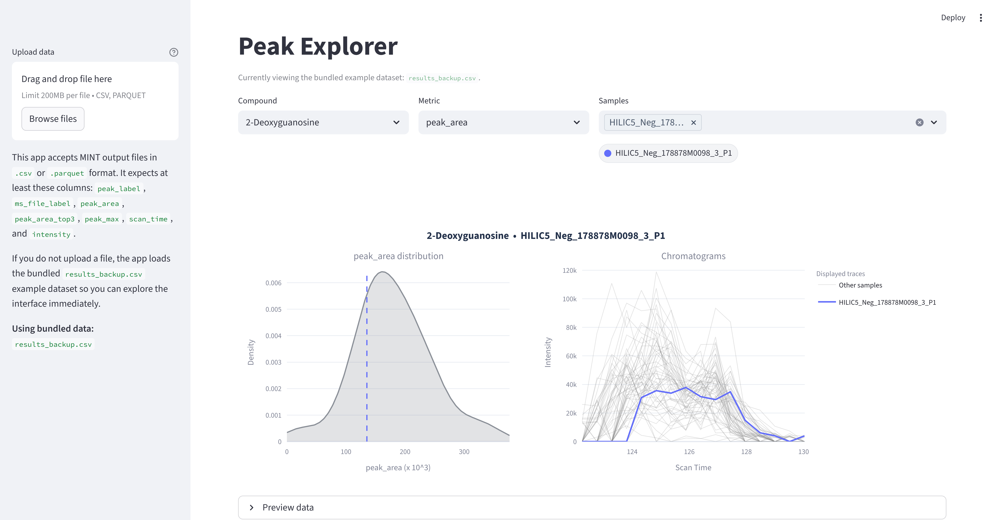

# Peak Explorer

Peak Explorer is a Streamlit app for exploring MINT peak output interactively. It lets you inspect the distribution of peak area values for a selected compound and compare chromatograms across samples in the same view.



## Features

- Upload `.csv` or `.parquet` MINT output files
- Fall back to the bundled `results_backup.csv` example dataset
- Select a compound and compare one or more samples
- View peak area distribution alongside chromatogram traces
- Preview the loaded dataset directly in the app

## Required columns

The app expects these columns:

- `peak_label`
- `ms_file_label`
- `peak_area`
- `peak_area_top3`
- `peak_max`
- `scan_time`
- `intensity`

## Run locally

Install dependencies:

```bash
pip install -r requirements.txt
```

Start the app:

```bash
streamlit run run.py
```

## Notes

- `scan_time` and `intensity` are expected to contain list-like values for chromatogram plotting.
- If no file is uploaded, the app loads `results_backup.csv` automatically.
